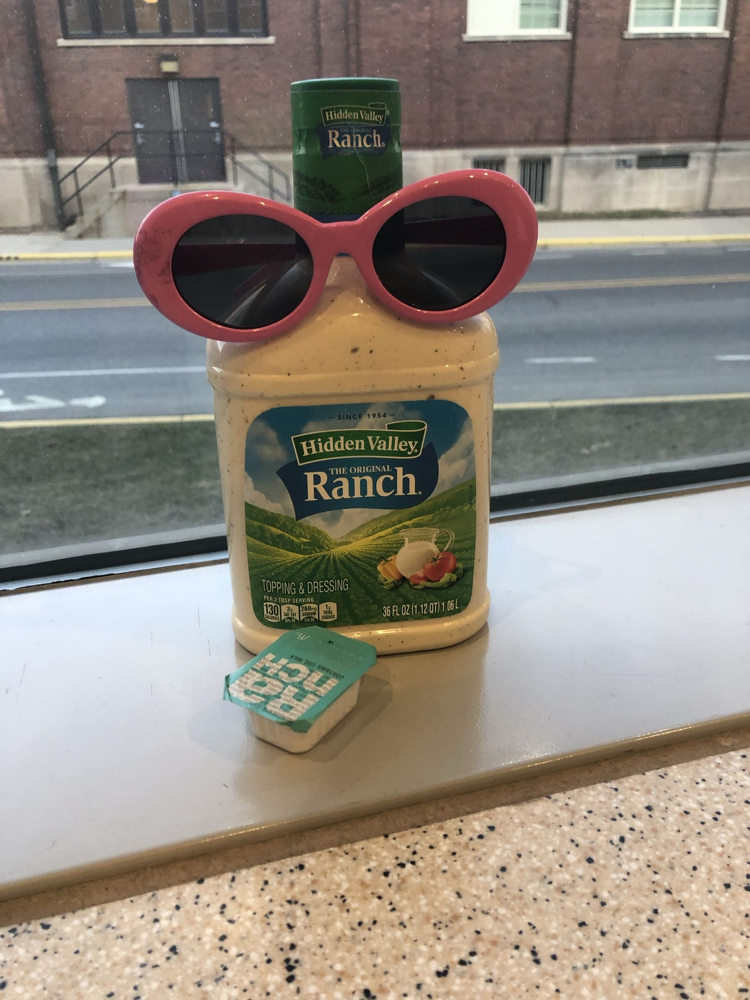

# Welcome!

Hi I'm Will, welcome to my dev blog! Here's a few (public) projects I was a part of:

* [PROS](https://pros.cs.purdue.edu/)
* [BLRS (SIGBots) Wiki](https://wiki.purduesigbots.com/)

This blog is mainly for opinions and articles that are better kept off the BLRS wiki. As an educational platform, the sigbots wiki should stay relatively sanitized of objective thoughts and opinions.

That being said, despite working on educational products (for free) for a little more than a half decade I can't claim to be an educator myself. That being said, that won't stop me from having (_completely unqualified_) takes on education!

My bread and butter is in software development, specifically embedded safety critical software. None of that stuff really belongs on the (mostly VEX centric) BLRS wiki either, and there's a wealth of information that I've gathered over the years that is itching to go somewhere.

<figure><figcaption></figcaption></figure>

As with any dev or personal blog, none of the thoughts I have here are filtered too much, nor do I claim to be a subject matter expert in any field. None of what I say on here represents any of my employers or organizations I've been affiliated, future, past or present.

